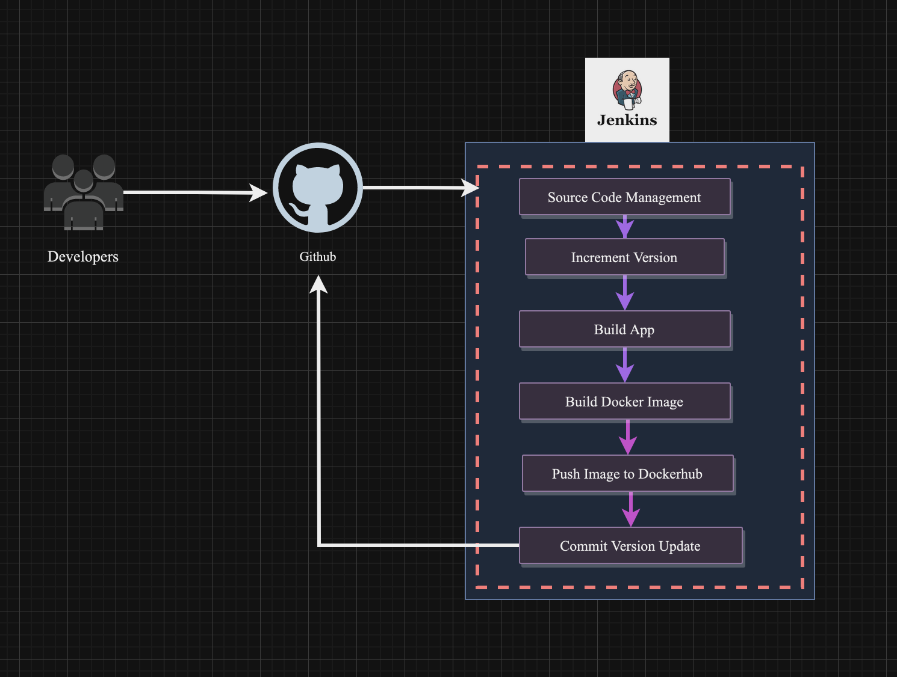

# Java Maven App Jenkins Pipeline

This branch contains a Jenkins pipeline written in Groovy for a Java Maven application. The pipeline automates the process of version incrementation, building the application, creating a Docker image. Additionally, the pipeline includes a step for committing the version update back to the Git repository.

## Jenkins Pipeline Stages

Pipline starts changes pushing to the branch

### 1. Increment Version

- Increments the application version based on the Maven versioning schema.
- Parses the current version from the `pom.xml` file and increments the next incremental version.
- Commits the updated version to the Git repository.

### 2. Build App

- Cleans and packages the Java Maven application using the `mvn clean package` command.

### 3. Build Image

- Builds a Docker image for the application.
- Uses Docker Hub credentials for authentication.
- Tags the Docker image with the incremented version and pushes it to Docker Hub.

<!-- ### 4. Deploy

- Deploys the Docker image to an EC2 instance (Note: Implementation details need to be added). -->

### 5. Commit Version Update

- Commits the version update back to the Git repository.
- Configures Git user information for Jenkins.
- Uses GitHub credentials for authentication.

## Pipeline Execution Flow

1. **Increment Version:**
   - Increments the version in `pom.xml`.
   - Commits the version change to a dedicated branch (`jenkins-version-bump`) in the Git repository.

2. **Build App:**
   - Cleans and packages the Java Maven application.

3. **Build Image:**
   - Builds a Docker image with the incremented version.
   - Logs in to Docker Hub using provided credentials.
   - Pushes the Docker image to the Docker Hub repository.

4. **Deploy:**
   - Deploys the Docker image to an EC2 instance (Implementation details need to be added).

5. **Commit Version Update:**
   - Commits the version change back to the Git repository on a separate branch.

## Prerequisites

- Jenkins environment set up.
- Maven tool configured in Jenkins.
- Docker installed on the Jenkins agent.
- Docker Hub credentials configured in Jenkins.
- GitHub credentials configured in Jenkins.

**Note:** Ensure that necessary environment variables and configurations are set up in your Jenkins environment before running the pipeline.

